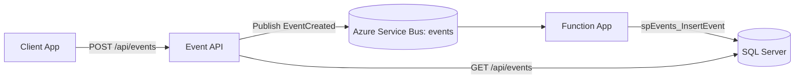

# Architecture

## Overview
The solution uses a split ingestion and persistence workflow. The API validates requests and publishes event messages to Azure Service Bus. A Function App processes messages and writes them to SQL Server. The API also reads directly from SQL for event queries.

## Components
- **Event API** (`Reenbit.BMAD.API`): REST endpoints, CORS, Serilog logging.
- **Core/Domain** (`Reenbit.BMAD.Core`, `Reenbit.BMAD.Domain`): boundaries, entities, result types.
- **Service Bus Publisher** (`Reenbit.BMAD.ServiceBus`): publishes to `events` queue.
- **Function App** (`Reenbit.BMAD.FunctionApp`): Service Bus trigger that persists events.
- **SQL Server** (`Reenbit.BMAD.Sql`): tables and stored procedures for events.
- **AppHost** (`Reenbit.BMAD.AppHost`): local orchestration with Aspire.

## Data Flow

## Storage
- `EventTypes` table: seeds `PageView`, `Click`, `Purchase`.
- `Events` table: stores `UserId`, `TypeId`, `Description`, `CreatedAt`.

## Key Design Choices
- Asynchronous write path via Service Bus for responsiveness.
- Stored procedures with Dapper for data access.
- Aspire AppHost for local dependencies and wiring.
